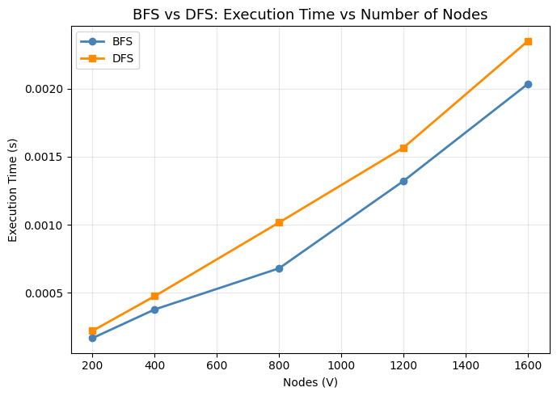
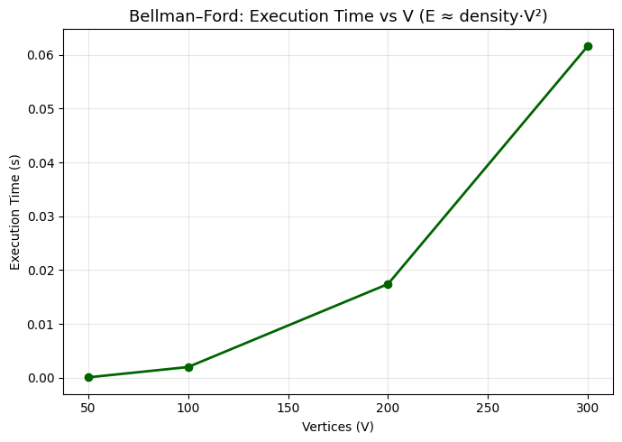
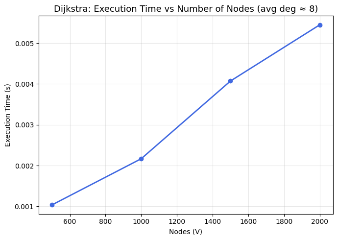
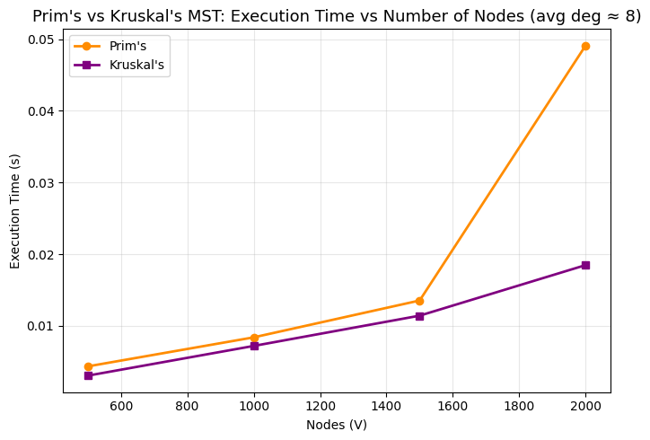

# Graph Algorithms: Lab Assignment 3

A practical, end-to-end implementation of **four real-life problems** using **BFS/DFS**, **Bellman–Ford**, **Dijkstra**, and **Minimum Spanning Trees**, with **single-cell demos**, **scaling plots**, and **clear trade-off explanations**.

---

## Project Objectives

* Model realistic domains—social networks, routing, navigation, and infrastructure—using graph structures.
* Implement the four core graph algorithms and **visualize their performance** across increasing scales.
* Present **algorithmic suitability** in context, highlighting the strengths and limitations of each method.

---

## Repository Layout

```
graph_realworld.ipynb          — implementations, demos, plots, and analysis for all four graph problems.
images/                        — exported timing figures (PNG).
requirements.txt               — minimal dependencies.
README.md                      — this document.
```

---

## Setup

Create and activate a virtual environment.

### macOS/Linux:

```bash
python -m venv venv && source venv/bin/activate
```

### Windows (PowerShell):

```powershell
python -m venv venv; .\venv\Scripts\Activate.ps1
```

Install dependencies:

```bash
pip install -r requirements.txt
```

Launch Jupyter:

```bash
jupyter notebook
```

---

## How to Run

Open `graph_realworld.ipynb` and run all cells from top to bottom. This will:

1. Validate imports and environment.
2. Define each problem’s algorithm with short explanations and complexity notes.
3. Run **one demo per problem** and print clean summaries.
4. Generate and save **one timing plot** per problem into the `images/` folder.

---

## Implemented Problems

| Problem                               | Strategy               |
| ------------------------------------- | ---------------------- |
| **Social Network Friend Suggestion**  | BFS / DFS              |
| **Route Finding with Negative Edges** | Bellman–Ford           |
| **Emergency Response Path Planning**  | Dijkstra (binary heap) |
| **Network Cable Installation**        | MST (Prim/Kruskal)     |

---

## Reproducible Profiling

* **Timing**: Each plot measures execution time versus scale (nodes/edges depending on the problem).
* **Inputs**: Synthetic but deterministic graph generators are used for consistency.
* **Figures**: Exported with `dpi=150` and `bbox_inches='tight'` for clarity.

---

## Plots Generated

Each problem produces a single performance figure.

### Social Network Friend Suggestion (BFS/DFS)



→ Execution time vs number of users in the graph.

> **Insight**: BFS scales linearly with edges and is ideal for finding level-wise “friend-of-friend” sets.

---

### Route Finding with Negative Edges (Bellman–Ford)



→ Execution time vs number of vertices.

> **Insight**: Bellman–Ford is slower but handles negative weights and detects negative cycles safely.

---

### Emergency Response Path Planning (Dijkstra)



→ Execution time vs number of intersections.

> **Insight**: Using a min-heap keeps the algorithm efficient for large positive-weight road networks.

---

### Network Cable Installation (MST: Prim/Kruskal)



→ Execution time vs nodes in a growing infrastructure graph.

> **Insight**: Prim performs well on dense adjacency-list graphs; Kruskal is strong on sparse or edge-list inputs.

---

## Theoretical Complexities

| Problem                      | Strategy            | Time (Worst) | Space    | Notes                                                                   |
| ---------------------------- | ------------------- | ------------ | -------- | ----------------------------------------------------------------------- |
| **Friend Suggestion**        | BFS/DFS             | O(V + E)     | O(V)     | BFS finds degree-2 suggestions cleanly; DFS better for structure checks |
| **Negative-Edge Routing**    | Bellman–Ford        | O(V·E)       | O(V)     | Supports negative edges and cycle detection                             |
| **Emergency Routing**        | Dijkstra (min-heap) | O(E log V)   | O(V + E) | Fast and optimal for non-negative weights                               |
| **Cable Installation (MST)** | Prim/Kruskal        | O(E log V)   | O(V + E) | Prim good for dense graphs; Kruskal simple and powerful for edge lists  |

---

## Suitability and Trade-offs

| Strategy               | Best For                                       | Trade-offs                                                     |
| ---------------------- | ---------------------------------------------- | -------------------------------------------------------------- |
| **BFS/DFS**            | Neighborhood discovery and structural analysis | DFS doesn't preserve levels; BFS memory grows with wide layers |
| **Bellman–Ford**       | Networks with negative weights or rebates      | Significantly slower than Dijkstra                             |
| **Dijkstra**           | Road networks, delivery routing, ETAs          | Cannot handle negative edges                                   |
| **MST (Prim/Kruskal)** | Infrastructure cost minimization               | Does not give shortest paths—only minimum total wiring         |

---

## Observed vs Expected

* **BFS/DFS**: Time increases linearly; good scalability for large friendship graphs.
* **Bellman–Ford**: Matches O(V·E) behavior; overhead noticeable at larger scales.
* **Dijkstra**: Logarithmic factor dominates due to heap operations.
* **MST**: Both algorithms scale with `E log V`; graph density affects which performs better.

---

## File Naming

Figures saved using clear and consistent names:

```
bfs_time_nodes.png
bellmanford_time_vs_v.png
dijkstra_time_vs_nodes.png
prim_mst_time_vs_nodes.png
```

---

## Re-running and Reproducibility

* Use fixed seeds for graph generation to make comparisons stable.
* Keep scale (V, E) lists consistent for all timing experiments.

---

## Requirements

* **Python 3.9+**
* `jupyter`, `matplotlib`
  (optional: `numpy` for graph generation)

Install via:

```bash
pip install -r requirements.txt
```

---
